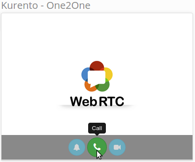
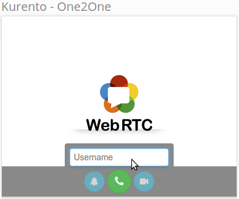
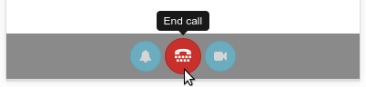

This widget provide an easy way for adding videoconference support into your dashboards.

This widget needs a
[service](https://github.com/wirecloud-fiware/kurento-example-services-scala)
running as middleware between you and a kurento media server. You can find an
instance of this service on FIWARE Lab
(https://wirecloudkurento.lab.fiware.org/). This server is used by default, but
you can deploy your own version and configure this widget for using it instead.

Latest version of this widget is always [provided in FIWARE Lab](https://store.lab.fiware.org/search/keyword/KurentoStarterKit) where you can make use of it on the [Mashup portal](https://mashup.lab.fiware.org).

## Preferences

* **Server URL** - URL of the one 2 one server.
* **Standalone** - Allows choose the user for calling. Default is `true`.

## Wiring

### Input Endpoints

- `User id` - Type `String`. Fills the target user name input with the provided user name.

- `Call user` - Type `String`. Calls the user received only if the current state of the call is `ENABLED_CALL`.

- `Hang up user` - Type `String`. Hangs up current videoconference call. This only take place if the received user name match the username of the other participant on a call and the widget is in one of the following states: `CALLING`, `ANSWERING` and `BUSY_LINE`.

  > **Note**: if user received is not the user of the call, the widget will do nothing and notify about that.

### Output Endpoints

- `Call state` - Type String. Sends the current state of the call only when it changes. The state list is the following: `UNREGISTERED`, `REGISTERED`, `ENABLED_CALL`, `CALLING`, `ANSWERING` and `BUSY_LINE`.

## Usage

### Making calls

#### Manual calls

Calls can be started by clicking on the call button:

The target user can be specified using a text field (only available when the widget is in **Standalone** mode [see the description of the **Standalone** preference for more info]):

Or provided by other widgets/operators throught the `User id` input endpoints.

#### Calling from other widgets/operatos

Other widgets/operators can start a call by sending an event to the `Call user` endpoint. The user is specified in the event without requiring end-user to select the user to call.

### Hang Up an User

Once the user is in a call, the button changes to allow to hang up the call:

### Answer/Decline an Incoming Call

Finally, if an user wants to stablish a call, the widget displays a sliding modal which allows to you choose to answer the incoming call or decline it:

### Show/Hide Local Webcam

Whereas you are on a call, the button on the right allows you to show or hide your webcam.

<!--  -->

## Copyright and License

Copyright 2014-2015 CoNWeT Lab., Universidad Politecnica de Madrid

Licensed under the Apache License, Version 2.0 (the "License");
you may not use this file except in compliance with the License.
You may obtain a copy of the License at

  http://www.apache.org/licenses/LICENSE-2.0

Unless required by applicable law or agreed to in writing, software
distributed under the License is distributed on an "AS IS" BASIS,
WITHOUT WARRANTIES OR CONDITIONS OF ANY KIND, either express or implied.
See the License for the specific language governing permissions and
limitations under the License.
